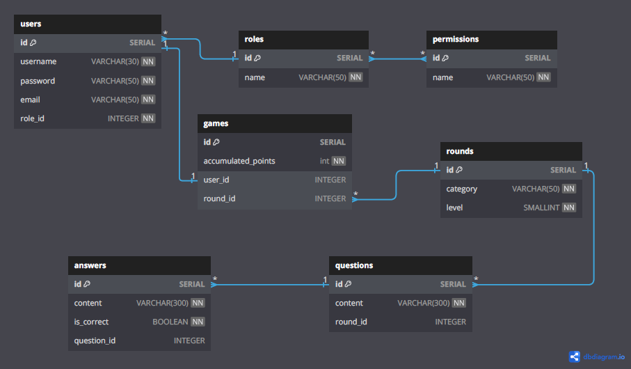

        -   Database model


# Database Setup

##1 Requirements

    - PostgreSQL installed locally or use docker (recommended)

##2 Initial Setup
- Docker (recommended)
  1. Create a new .env file where you are going to place all the environment variables, example:

  ```bash
    POSTGRES_USER=user
    POSTGRES_PASSWORD=password
    POSTGRES_DB=database

- Local PostgreSQL
  1. Create a new database and run the migration scripts to run the initial db setup